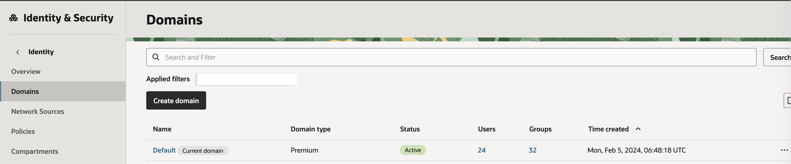
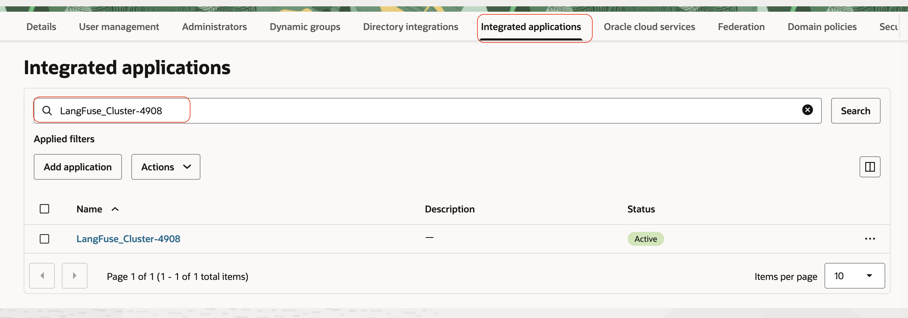
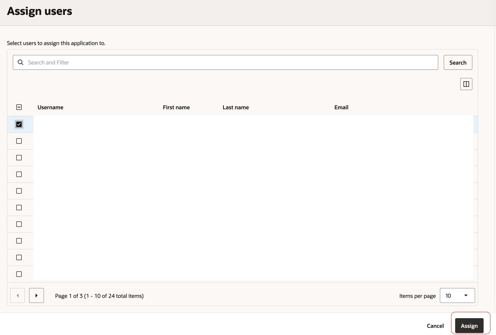
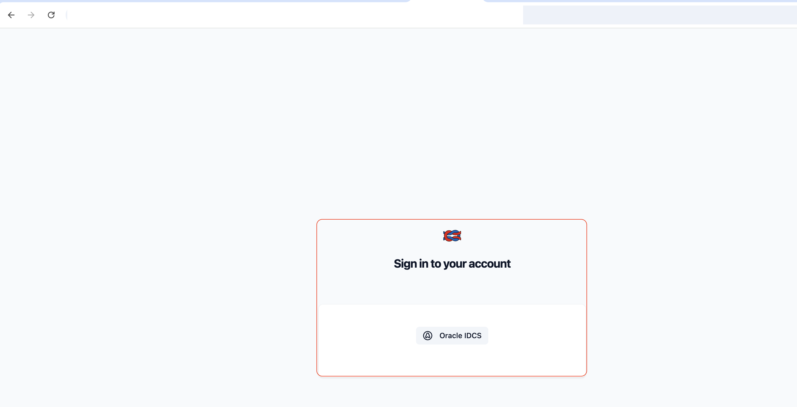

## How to Launch the deployed (Langfuse) application

### Fetch the output references 

- If you have deployed the stack using OCI resource manager , use Stack > Job details > Outputs and make a note of cluster_name and langfuse_url 

- If you have deployed the stack using `terraform` cli and then run `terraform output` and fetch the `integrated_app_name`  and `langfuse_url`.

### Register desired user to the langfuse app integrated with your domain .

- Use OCI Console > Identity & Security > Domains 
- Ensure to switch to the appropriate compartment 

- Click on the domain used for the deployment 
- Click on option `Integrated applications` 
- Search using `integrated_app_name` captured 

- Click the app > Click User and Assign user 

- Select and assign at least one desired user .

- Use the `langfuse_url` and launch the application using a browser .

- Click `oracle idcs` and use SSO credentials when prompted and login to the application.

